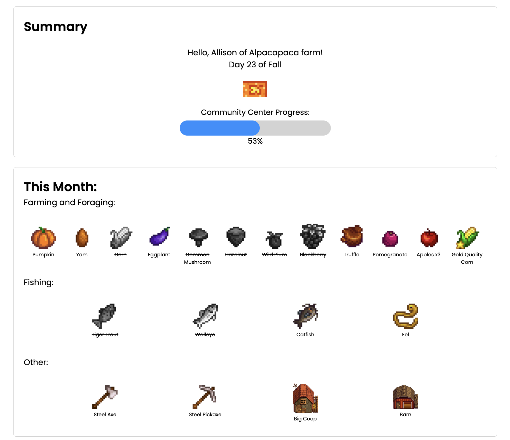
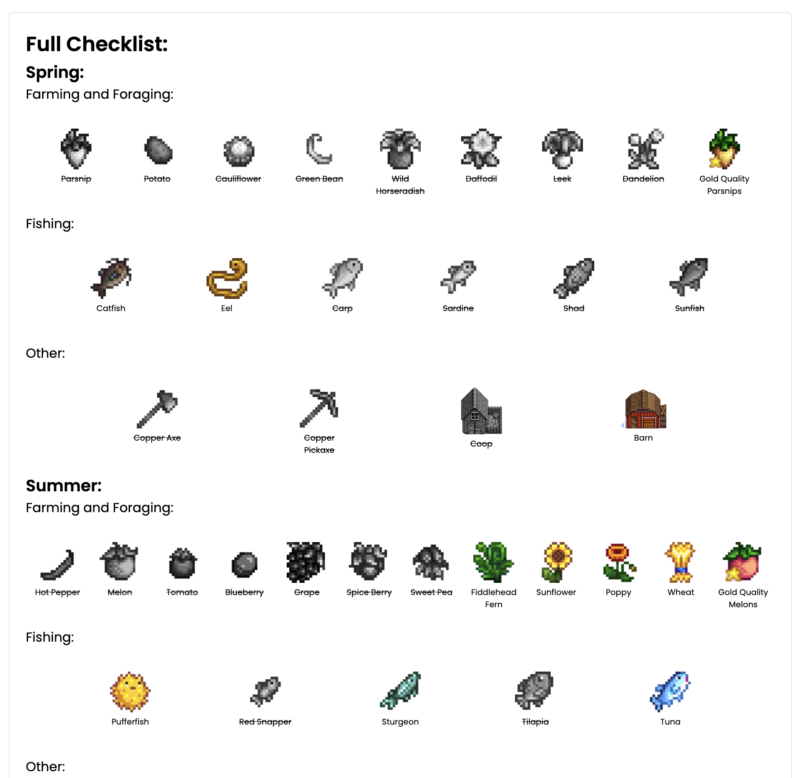
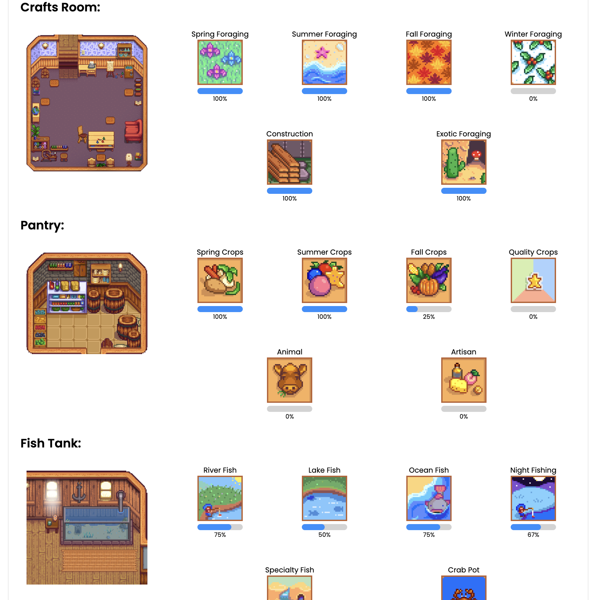
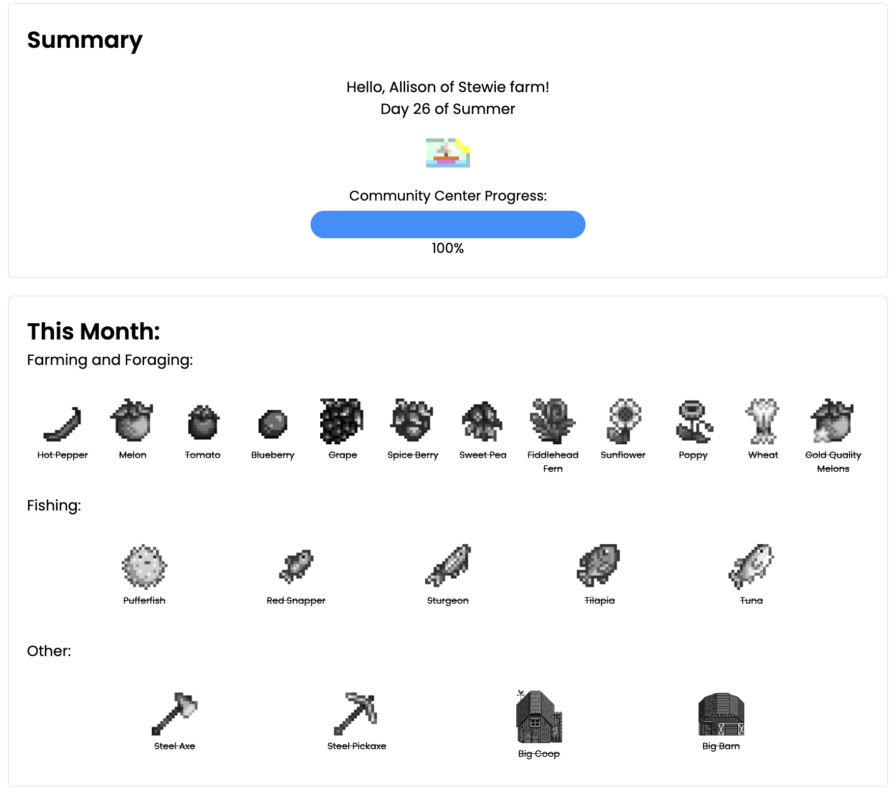
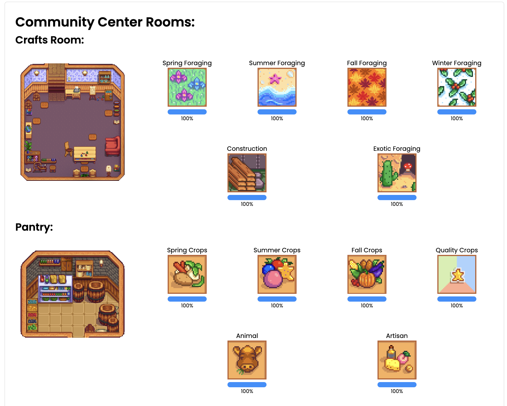

# stardew_checklist

This app parses a [Stardew Valley](https://stardewvalley.net/) save file to create a checklist to help the player complete the Community Center within the first in-year game. This is a personal project. 

Although recommended for use in player's first year, the checklist will continue to update if items are missed. For example, if a carp is not caught in Spring of Year 1, it will appear again in Summer and Fall until completed. 

The entire checklist for the year is available in the "Full Checklist" section. Completed items appear in black and white with their names crossed out. (This is for my color-blind dad.) All objects are linked to the [Stardew Wiki](https://stardewvalleywiki.com/Stardew_Valley_Wiki).

Credit for creating this checklist goes to [Salmence](https://www.youtube.com/watch?v=hsPo9mRpMcs) on YouTube.

## Features
- Summary of current day, season, and player's progress with the Community Center
- Checklist for player's current month
- Checklist for player's next month
- Checklist for items completed any month
- Full checklist to complete the Community Center in a year
- Summary of player's progress with all Community Center rooms and bundles

## Want to test the app?
1. Download any of the files in the [test](https://github.com/allison-no/stardew_checklist/tree/main/test) folder.
2. Access the [app](https://allison-no.github.io/stardew_checklist/).
3. Upload files in the File Upload section.

Notes about test files:
- [test1](https://github.com/allison-no/stardew_checklist/tree/main/test/test1) is a Year 1 save in Fall with about half the Community Center completed. For example, you'll notice it is supposed to have a Deluxe Barn, but doesn't have any Barn. So, in the "This Month" section, the checklist shows that the player needs a Barn and not a Deluxe Barn. However, it can be seen that the player is off track in the "Full Checklist" section.
- [test2](https://github.com/allison-no/stardew_checklist/tree/main/test/test2) is a Year 2 save in Summer with the Community Center completed. All of the checklist sections are marked as completed.
- [test3](https://github.com/allison-no/stardew_checklist/tree/main/test/test3) is a Year 1 save in Spring with nothing in the Community Center completed. All of the checklist sections are marked as uncompleted and the player's "This Month" section is on track.

## Don't want to test the app? Check out these screenshots:
### test1 savefile (Year 1, Fall):

### test2 savefile (Year 2, Summer):

###### Stardew Valley and all Stardew Valley images were developed by [ConcernedApe](https://twitter.com/ConcernedApe").